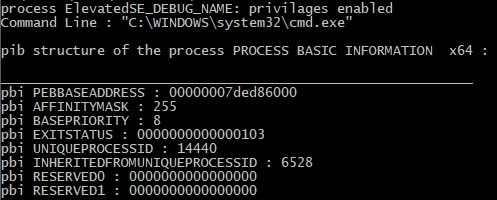

PROCESS_BASE_INFORMATION     "pib tbi debug thread security DCOM"

This simple example show how to get basic information about remote process. 
Programm written for x64 bit and x86 bit Windows OS. 

     command line and pbi
